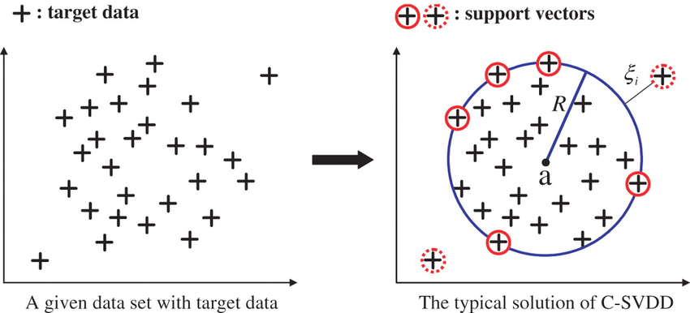
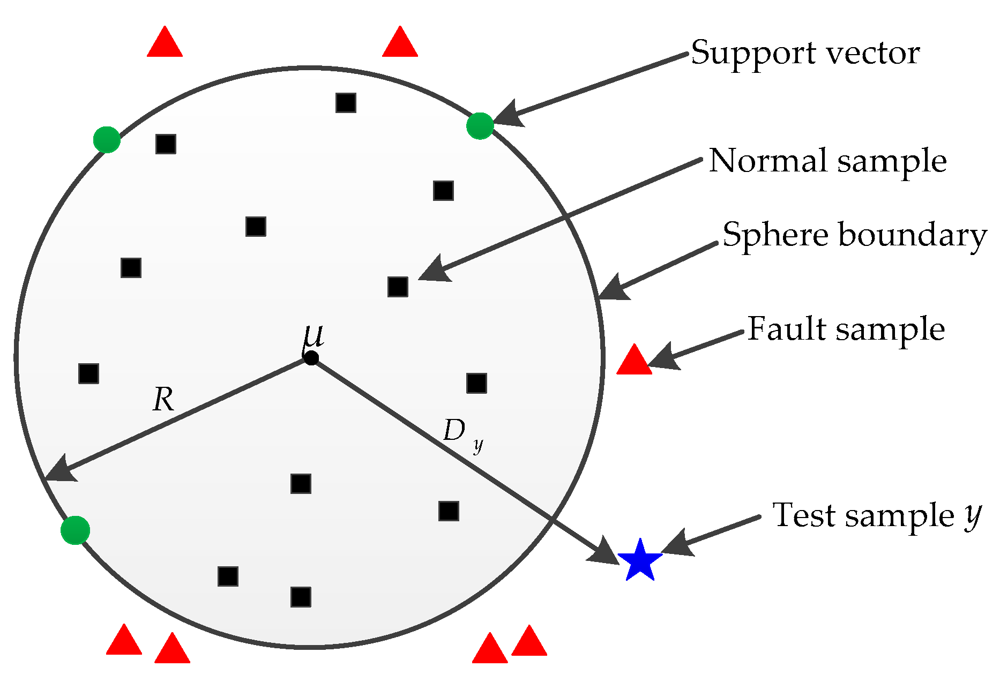

# Support Vector Data Description (SVDD)

- This repo contains an implementation of [this](https://link.springer.com/article/10.1023/B:MACH.0000008084.60811.49) state of the art anomaly detection support vector machine with R. SVDD in this repo has been designed to accept both inliers and outliers

## Running the code
Download & extract the package:
- please run svdd_dmo.R in src
